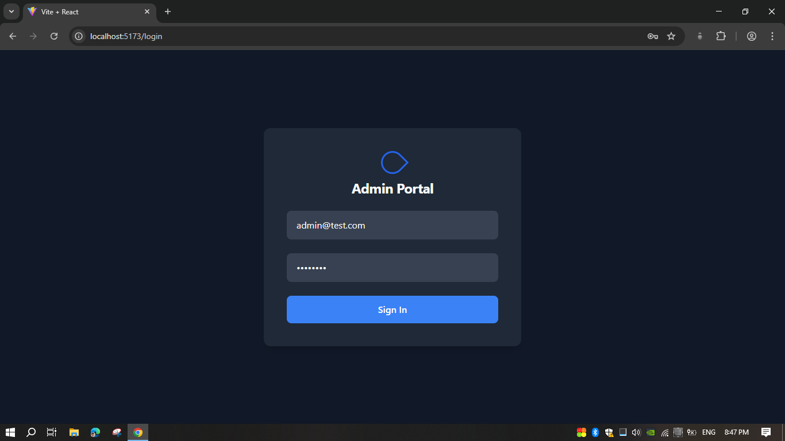
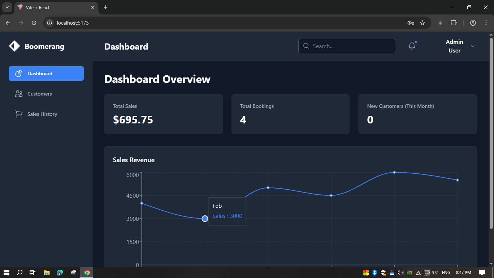
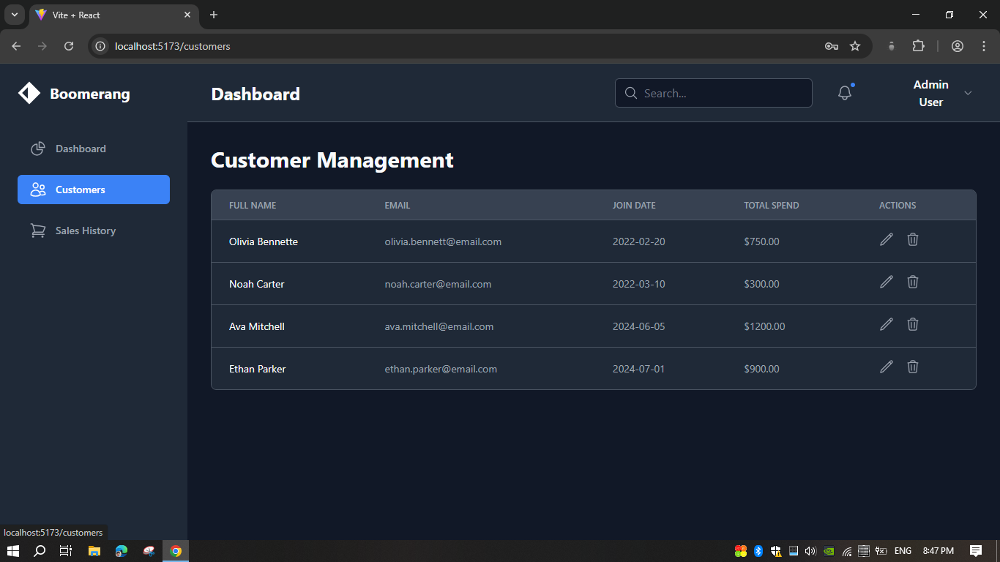
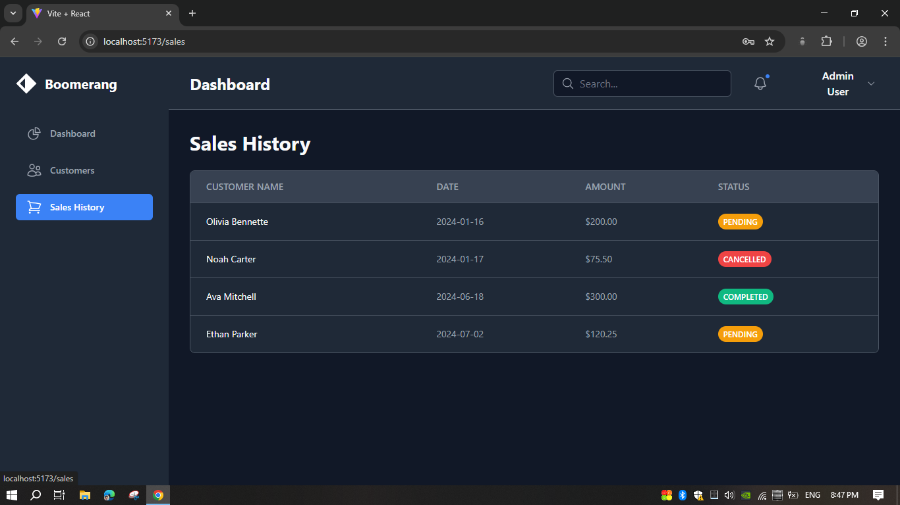

# Boomerang - Full-Stack Admin Dashboard

Submitted by: Lahiru Jayawardhane

This project is a full-stack web application built for the Boomerang Software Engineer practical test. It features a secure Spring Boot backend and a modern, responsive React frontend.

---

### Task Option Chosen

*   **Option 1: Web-Based Admin Dashboard**

---

### Features Implemented

*   **Full-Stack Architecture:** A complete separation of concerns between the Spring Boot REST API and the React single-page application.
*   **Secure JWT Authentication:** End-to-end token-based security. Users must log in to access protected routes, and the JWT is automatically sent with every API request.
*   **Dynamic Dashboard:** The dashboard fetches and displays real-time key performance indicators (KPIs) like Total Sales and New Customers.
*   **Interactive Data Charts:** An interactive line chart on the dashboard visualizes sales data (using Recharts).
*   **Full CRUD Functionality:** The Customer Management page supports creating, reading, updating, and deleting customers.
*   **Database-Driven:** All data is persisted in a MySQL database, which is seeded on startup for easy testing.
*   **Professional Git Workflow:** The project was developed using a feature-branching strategy (`dev`, `main` branches).

---

### Technologies Used

*   **Backend:**
    *   Java 17
    *   Spring Boot 3
    *   Spring Security (JWT)
    *   Spring Data JPA
    *   Maven
*   **Frontend:**
    *   React 18 (with Vite)
    *   React Router
    *   Tailwind CSS
    *   Axios (for API communication)
    *   Recharts (for charting)
*   **Database:**
    *   MySQL
*   **Version Control:**
    *   Git & GitHub

---

### Instructions to Run the Project

**Prerequisites:**
*   Java JDK 17+
*   Apache Maven
*   MySQL Server
*   Node.js v18+ & npm

**1. Backend Setup:**
*   Clone the repository.
*   Create a new MySQL database: `CREATE DATABASE boomerang_db;`
*   Open the `backend/src/main/resources/application.properties` file.
*   Update the `spring.datasource.username` and `spring.datasource.password` fields with your local MySQL credentials.
*   Navigate to the `backend` directory and run the application:
    ```bash
    mvn spring-boot:run
    ```
*   The backend will start on `http://localhost:8080`. It will automatically seed the database on the first run.

**2. Frontend Setup:**
*   Open a new terminal.
*   Navigate to the `frontend` directory.
*   Install all necessary packages:
    ```bash
    npm install
    ```
*   Run the development server:
    ```bash
    npm run dev
    ```
*   Open your browser and navigate to `http://localhost:5173`.

**Login Credentials:**
*   **Email:** `admin@test.com`
*   **Password:** `password`


---

### Screenshots

**Login Page**


**Main Dashboard**


**Customer Management**


---```

**Explanation:**
*   `![Login Page]` is the "alt text". It's what screen readers will say, and what will be displayed if the image fails to load.
*   `./screenshots/login-page.png` is the relative path. It tells GitHub to look in the `screenshots` folder (which is in the same directory as the README) for the file `login-page.png`.

**Pro Tip: Create a Table for a Side-by-Side View**
For an even cleaner look, you can use a Markdown table to display screenshots next to each other. This is highly professional.

```markdown
---

### Application Preview

| Dashboard Overview                                   | Customer Management                                    |
| ---------------------------------------------------- | ------------------------------------------------------ |
|        |          |

| Login Page                                     | Sales History                                    |
| ---------------------------------------------- | ------------------------------------------------ |
|          |            |

---
